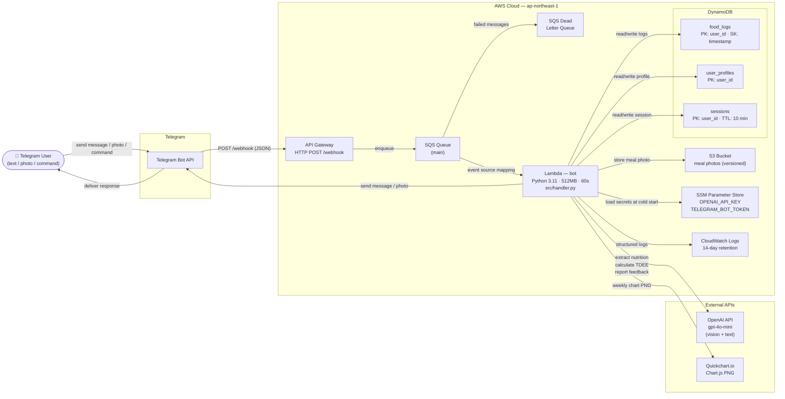

# Architecture Diagram

## Component Reference

| Component | Purpose |
|-----------|---------|
| **API Gateway** | Public HTTPS endpoint; direct SQS integration (no Lambda on inbound path) |
| **SQS** | Decouples Telegram webhook from Lambda; DLQ catches failures after retries |
| **Lambda `bot`** | All business logic: routing, OpenAI calls, DB reads/writes, report generation |
| **DynamoDB `food_logs`** | Every meal log; queryable by user + date range for reports |
| **DynamoDB `user_profiles`** | Registration data: age, weight, goal, TDEE target |
| **DynamoDB `sessions`** | Ephemeral `/register` wizard state; auto-expires after 10 min |
| **S3** | Stores raw meal photos referenced from food log entries |
| **SSM Parameter Store** | Secure storage for API keys (SecureString); loaded once at cold start |
| **CloudWatch Logs** | Lambda execution logs, 14-day retention |
| **OpenAI gpt-4o-mini** | Vision + text: extracts nutrition JSON, calculates TDEE, generates report commentary |
| **Quickchart.io** | Renders Chart.js grouped bar charts (kcal + macros) as PNG for weekly reports |

## Key Flows

### Food logging (text or photo)
1. User sends meal description or photo → Telegram → API Gateway → SQS → Lambda
2. Lambda calls OpenAI (with optional base64 image) → nutrition JSON
3. Save to `food_logs`; optionally upload photo to S3
4. Query today's totals → send summary back via Telegram

### User registration (`/register`)
1. Lambda creates session in `sessions` table (state = `awaiting_profile`, TTL 10 min)
2. User replies with profile text (age, weight, goal, etc.)
3. Session detected → OpenAI `calculate_tdee()` → profile saved to `user_profiles`
4. Session deleted; confirmation sent

### Daily / weekly report
1. Query `food_logs` for N days → aggregate by day
2. Weekly only: generate chart via Quickchart.io
3. If profile has goal: call OpenAI for personalised feedback
4. Send text report (+ chart photo for weekly) via Telegram
